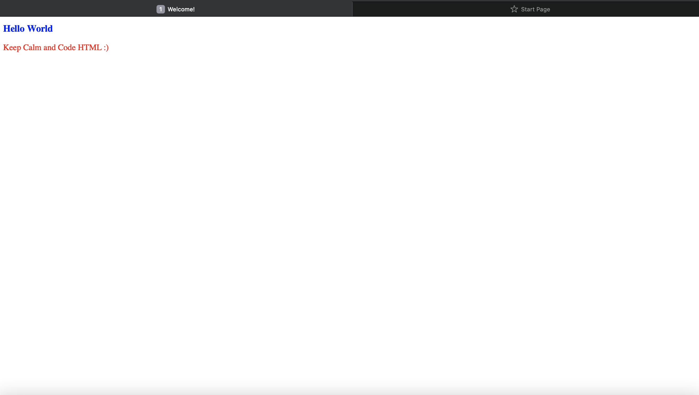

# Body

## `<body>`
- Body is the most important element in HTML file to define a webpage.
- The `<Body>` tag is the last child of `<html>` tag.
- The body tag starts and ends as same as other tags.
- The main contents of a webpage are placed inside body elements.
- All the attributes and elements can be used inside `<body>`. 

## Lets get introduced with some useful attributes
### But first lets get to know what "Attribute" is:
- Attributes tell us more about elements
- They appear on the openning tag of the elements that seperated by two parts. 
- First part is attribute name and second part is the value of the attribute.
- Both part are separated by `=` sign

Syntax

``` html
 <p class = "name"> Students Who Code</p>
```
Here, `class` is the name of the attribute and `"name"` is the value of given attribute's.

| Attribute Name|Description|
|-----------|-----------|
| `class`| One of most important attribute. This attribute is used to clasify elements. 
| `id` | id is another important attribute in HTML. It is similar to class attribute but it's value must be unique.
|`style`| Style attribute is used for inline CSS styling. Instead of making a internal or external CSS stylesheet, it's possible to style the webpage while writing html codes.


Sample
``` html
<!doctype html>
<html>

  <head>
     <title>Welcome!</title>
   </head>

  <body>
    <h1 style = "color: blue; font-size: large;"> Hello World</h1>
    <p style="color: red"> Keep Calm and Code HTML :)</p>
  </body>

</html>
```

Output



