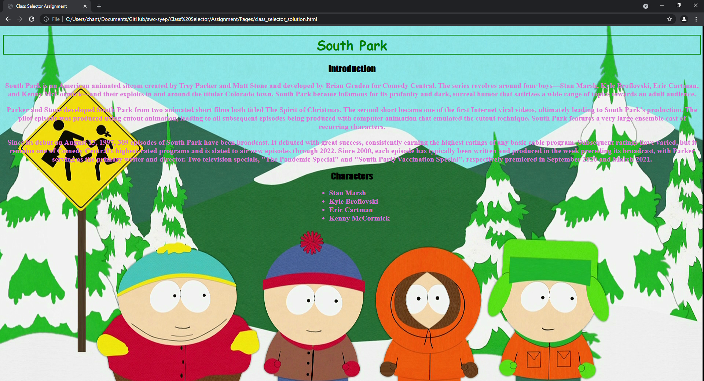

# Class Selector Assignment

Modify the ID selector assignment from last time. Use class selector instead of ID selector

1. Open the .html or .css file. (depends on whether you are doing it with internal or external CSS)

2. swap out some the ID selectors with class selectors

## Example
