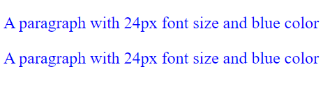

# Class Selector

## Class Selector V.S. ID Selector
The class selector works almost the same as ID selector. There are just some minor difference.
- A class can be selected by more than one element.
- Instead of starting with a hastag, class name startes with a **dot(.)**
- Syntax
```css
.className {
    style properties;
}
```
- You can also specify only which element can select that class by adding the tag name before the dot(.)
- If a class is specified for an element, the style will not be applied to any other elements that select the class
- Syntax
```css
tagName.className{
    style properties;
}
```
- **The code below is wrong**
```css
h1.myHeading1 {
    font-size: 48px;
    color: red;
}
```
```html
<p class="myHeading1">This is a paragraph</p>
<!--Since myHeading1 is specified for <h1> only, <p> will be on its default style.-->
```
|ID|Class|
|---|---|
|ID name start with a hastag(#)|Class name starts with a dot(.)|
|can only be selected by a single element|can be selected by multiple elements|
|Unique for a single element|Can specify for one type of element|
<br>

## An example with internal class selector
```html
<!DOCTYPE html>
<html>
    <head>
        <style>
            p.myStyle {
                font-size: 24px;
                color: blue;
            }
        </style>
    </head>

    <body>
        <p class="myStyle">A paragraph with 24px font size and blue color</p>
        <p class="myStyle">A paragraph with 24px font size and blue color</p>
    </body>
</html>
```
<br>

## An example with external class selector
- Inside the .css file
```css
p.myStyle {
    font-size: 24px;
    color: blue;
}
```
- Inside the .html file
```html
<!DOCTYPE html>
<html>
    <head>
        <link rel="stylesheet" type="text/css" href="id_selector_example.css">
    </head>

    <body>
        <p class="myStyle">A paragraph with 24px font size and blue color</p>
        <p class="myStyle">A paragraph with 24px font size and blue color</p>
    </body>
</html>
```
<br>

## Output for both examples
