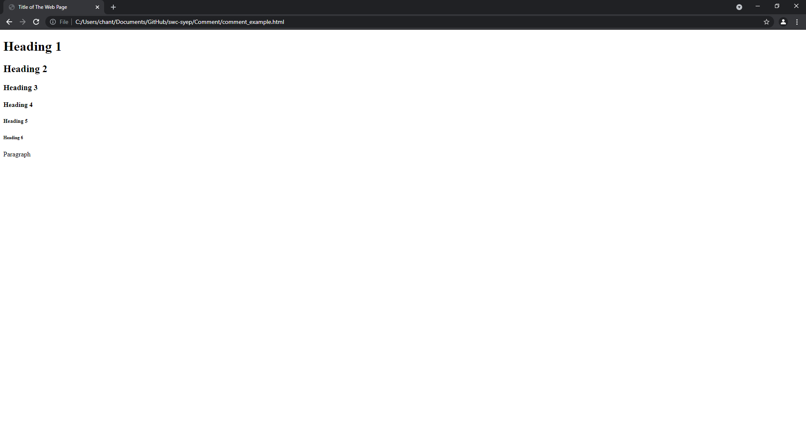

# Comment

## Why do we need to comment our code?
- When we work on a coding project, we usually work in a team and each of the team members will work on different aspect of the program. After we finish our work, we combine our them to make a complete and fully functioning program. Although we are responsible for different parts of the project, we still need to understand our teammates' work. That's when comment comes in handy because it allows us to explain what we did side by side with the code.
<br><br>

## Tag for comments in HTML
- Comment tag is unlike other regular tag in HTML. It does not have an end tag.
- `<!--comment-->` You can replace "comment" with your words.
- All the words you write in the comment tag are invisibe to the user.
- Basically, you can write anything in the comment tag. But keep in mind that we should make our comments **easy to understand**
<br><br>

## Example
```html
<!--no one could see the comments unless they have access to the original code-->
<!doctype html>
<html>

<head>
    <title>Title of The Web Page</title>
</head>
<!--you can use comment to help you locate a specific tag-->

<body>
<!--body tag start-->
    <h1>Heading 1<!--comment could be inside other tags--></h1>
    <h2>Heading 2</h2>
    <h3>Heading 3</h3>
    <h4>Heading 4</h4>
    <h5>Heading 5</h5>
    <h6>Heading 6</h6>
    <p>Paragraph</p>
</body>
<!--body tag end-->

</html>
<!--
comment
could
be
as
many
lines
as
you
want
-->
```
***Notes: Be carefrul. If you put comment inside the title tag, the comment will be displayed on the brower tab bar.***
<br><br>

## How users are going to see the web page

- *As you can see, none of the comments are displayed in the web page.*