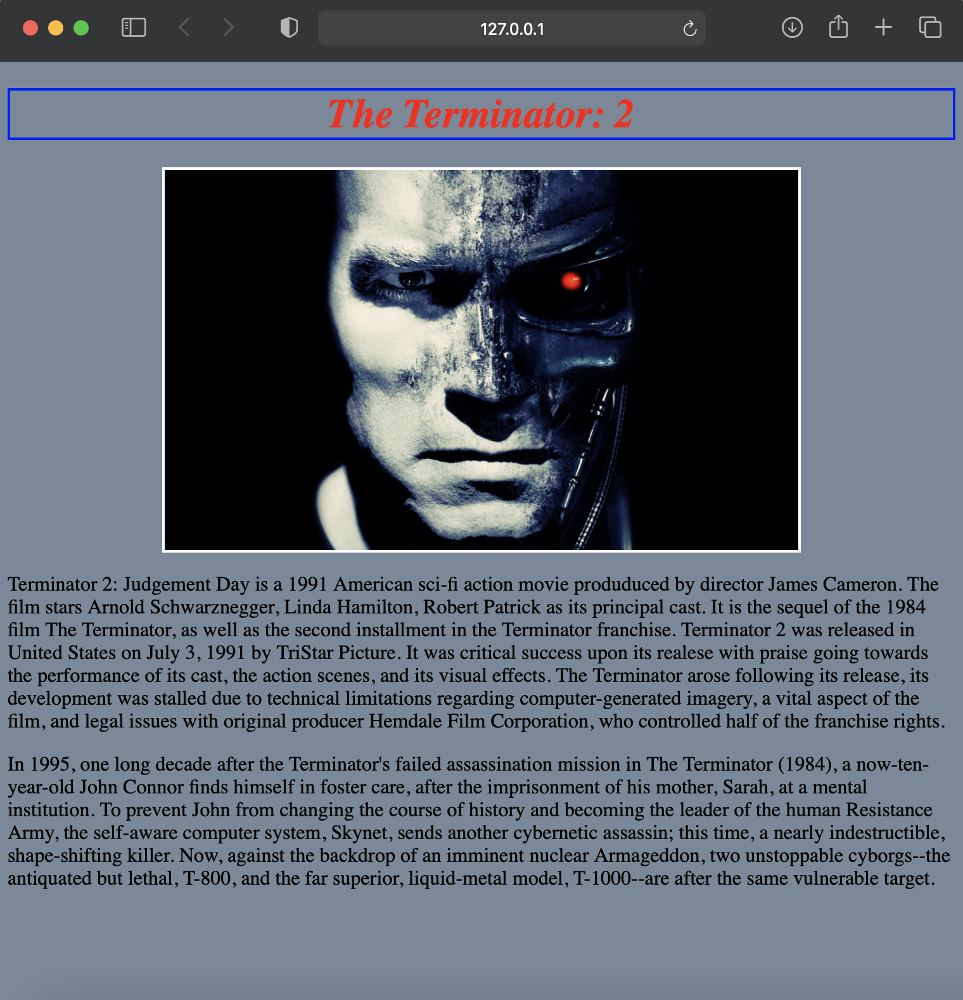

# Assignment for External CSS
Create a web page about your favourite TV show/ Movie using external style sheet.
- The movie title should be Bold, itallic and placed on the top 
- Align the movie title in the center
- Put a border around the Movie title. Border line should be solid 2px. (pick a border color as you wish)
- Add a movie poster and align it to the center
- Set poster measurements: width: 500px, height: 300px.
- Write about the movie/ show below the poster. (You can use Wikipedia for this)
- Set the page background to "lightslategray".
- Paragram about the movie should be in `
` element.
## Sample

