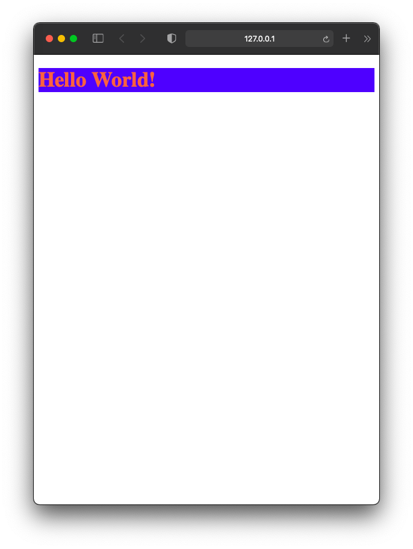

# External CSS
External CSS is the most famous and ideal CSS stylesheet implementation. It allows us to completely separate CSS files from HTML page. It's highly recommend to use external stylesheet if your website consist multiple web pages. 
## Advantages of using External style sheet
- We don't need to write css code in every html pages of a website. We just easily can refer the external CSS file using `<link>` element in the html page inside `<head>` section. 
- If any change needed we can do it by changing just the external CSS file. We don't need to change styling in every html pages.
- More organized and easy for debugging errors.
- We do the styling in a seperate files therefore there's no risk to mess up html files by accident.
- It makes easier to maintain larger websites.
## How to implement External CSS into HTML file?
- We need `<link >` element to add the CSS style sheet into our HTML page.
- `<link>` element should be inside `<head>` section.
- If we have multiple CSS files then we can make a new folder and place all the CSS files there.
- The style sheet file must have css extention.

Syntax
``` html
<link rel="stylesheet" href="example.css" type="text/css" media="screen">
```
There are few attributes in `<link>` tag.
## `<link>` Tag stylesheet Attributes
- `rel` - indicate the relationship of the link to the document. Value should be `stylesheet` when linking to a css file.
- `href` - this attribute includes the external CSS file location.
- `type` - indicates what type of file it is. in our case its text/css.
- `media` - for what media the stylesheet is to be included. in our case we will use `screen`. That indicate normal computer browser. Also, its not mandatory to include in the link tag. 

## The structure of External CSS
- We need to make a CSS file with `.css` extention
- CSS works by associating rules with HTML elements. 
- The rules contains two parts: Selector and a declaration.
- Selector indicates the elements from HTML file we want to style.
- Declaration consists with properties and values that will style the selecting element based on the value of the properties.

Syntax
``` html
 h1{font-size: 35px;
    color: tomato;
    background-color: blue}
```
## Example
lets create a html files that only print "Hello World". Then create an external style sheet with the same properties as given in Syntax.

HTML file:
``` html
<!doctype html>
<html>
  <head>
     <title>Hello</title>
    <link rel="stylesheet" href="example.css" type="text/css" media="screen" />
   </head>
<body>
    <h1> Hello World!</h1>  
</body>
</html>
```
Output:
