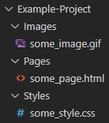

# Folder Structure and File Path
In this note, we are going to talk about something that is important but not quite related to coding. As a matter of fact, the thing we are going to talk about is going to be helpful for not just when you are coding in HTML or CSS, but for any kind of projects in any kind of languages. When we are doing a big project, it is a good thing to keep our files organized. To have clean view of our project, we can categorize our files with folders. In that way, it won't be so confused when we are presenting our project or looking for a specific files.
<br><br>

## Folder Structure
- Since we have been working with HTML and CSS. We will be using them as an example for how to organize our folders. But, keep in mind that organizing our files is not only essential for HTML and CSS project.



- Inside the project folder, we can have 3 folders of categories
    - Pages
        - Pages folder will save all the pages you have for your website, which is going to be all your .html files
        - Sometimes you can have more specific category inside your pages folder if you have a lot of different pages
    - Styles
        - Styles folder will save your .css files
    - Images
        - Images folder will save all your imageas that are used by your website

*Notes: There really are not any written clear standard on how to organize your files. The three folders above are just the base. You can add more folder to help you organize if it isnecessary.*
<br><br>

## File Path
- The thing we are going to talk about is a little bit related to coding. To be more specific, how modify the file path when we have created different folders and want to link our .css file to our .html file
- In all our previous example, we put our .css file and .html in the same folder, Therefore, the code that link them looks like this
```html
<link rel="stylesheet" type="text/css" href="./index.css">
<!--or-->
<link rel="stylesheet" type="text/css" href="index.css">
```
- In terms of file path, there are some useful things that we could learn about.
    - if the other file you want to include or link to your current file is in the same folder, we can use **./(dot slash)** for current folder or we can just type the file name for file path
    - if the file is in another folder we can use **../(dot dot slash)** to take us to the parent folder or the current directory and then access the other folder
<br><br>

## Example
- Let say we have a folder named "Example-Project" and inside it, we have "Pages", "Styles" and "Images" folders.
- If we have a page that needs to link a .css file in the Styles folder or an image in the Images folder, the file path is going to look like this
```html
<link rel="stylesheet" type"text/css" href="../Styles/index.css">

<!-- 
    Since the .html file is in the Pages folder, "../" will take us back to the Big Project folder.
    When we are there, then we could add "Styles/" or "Images/" to go into the specific folder and link up our desired files.
-->
```