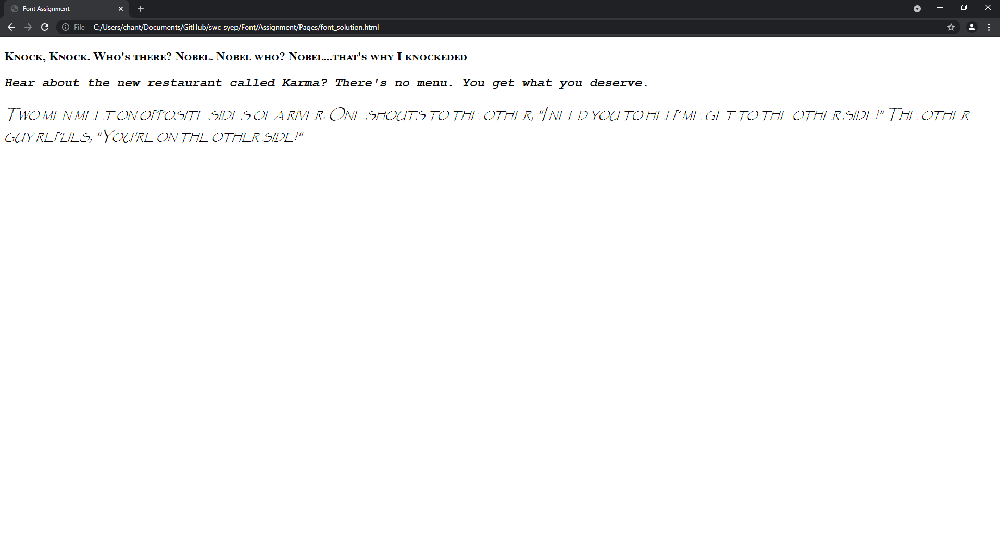

# Font Assignment

Apply the required style to the text using external CSS with ID selector and `
` element

1. "Knock, Knock. Who's there? Nobel. Nobel who? Nobel...that's why I knockeded"
    - size: 24px
    - weight: bold
    - vairant: small capitals
    - family name: Times New Roman
    - generic name: Serif

2. "Hear about the new restaurant called Karma? There's no menu. You get what you deserve."
    - size: 1.5em
    - style: italic
    - weight: 900
    - family name: Courier New
    - generic name: Monospace

3. "Two men meet on opposite sides of a river. One shouts to the other, "I need you to help me get to the other side!" The other guy replies, "You're on the other side!""
    - size: 20pt
    - style: italic
    - vairant: small capitals
    - family name: Papyrus
    - generic name: Fantasy

## How the output should look like
