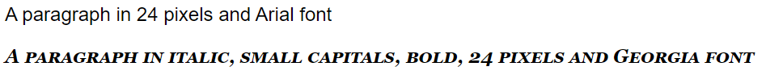

# Font

Today we are going to talk about how to manipulate the font with CSS. When we are talking about font, there are more than one propertiy that we can modify a text with.
<br><br>

## Size
- Changing the font size is the most common important thing in web design.
- Be careful, we should not make paragraph and heading that look like each other.
- The units we can use are pixel(px), em, point(pt), percentage(%)
- There is a special unit called viewport width(vw). Text that is in vw will resize by itself when we resize the browser window
```html
<p style="font-size: 16px">A paragraph in size 16 pixels</p>
<p style="font-size: 1em">A paragraph in size 1 em</p>
<p style="font-size: 12pt">A paragraph in size 12 points</p>
<p style="font-size: 100%">A paragraph in size 100 percent</p>
<p style="font-size: 2vw">A paragraph in size 2 viewport width</p>
```
- Output in full screen window


- Output in smaller window


<br><br>

## Style
There are total 3 styles 
```html
<p style="font-style: normal">A paragraph in normal font style</p>
<p style="font-style: italic">A paragraph in italic font style</p>
<p style="font-style: oblique">A paragraph in oblique font style</p>
```
*Notes: italic and oblique look similar to each other but oblique is less supported.*
<br><br>

## Weight
```html
<p style="font-weight: normal">A paragraph in normal font weight</p>
<p style="font-weight: bold">A paragraph in bold</p>
```
List of values for weight
|Value name|Description|
|----------|-----------|
|normal|Default normal text|
|bold|Thick text|
|bolder|Thicker text|
|ligher|Thin text|
|100, 200 ... 900|From thin to thick. 400=normal. 700=bold|
<br>

## Variant
```html
<p style="font-variant: normal">A Paragraph in normal font variant</p>
<p style="font-variant: small-caps">A PARAGRAPH IN SMALL CAPS</p>
```


- small-caps is short for small capitals which makes the text all uppercase letter but in smaller size
<br><br>

## Family
- The family property is the one that make your text look interesting
- There are two types of font family names
    - family-name
    - generic-family
- Fallback syste
    - We can give multiple font names to the font-family property
    - If the browser does not support the first font, it will try the next one
    - We always ends it with a generic-family name, so if all of the font before the genric family fails, the system will apply a font in that generic family.
```html
<p style="font-family: Lato, 'Lucida Grande', Tahoma, Sans-Serif">
<!--
    The browser will try out the font starting with Lato. 
    If all of the fonts are not supported by the browser, a similar font in the generic family Sans-Serif will be used
-->
```
*Notes: Each font name is separated by comma and if the font name contains space, we must quote the font name. If the font-fanmily property is used inside the style attribute, we must use single quote to quote the font name that has space.*
<br><br>

## Shorthand
- Since there are more than one properties in font and we might need to use them all for one element, it will be painful to type the proterty name one by one
- CSS actually allows us to put all values in one font property
```html
<p style="font: 24px Arial, Sans-serif">A paragraph in 24 pixels and Arial font</p>
<p style="font: italic small-caps bold 24px Georgia, Serif">A paragraph in italic, small capitals, bold, 24 pixels and Georgia font</p>
```


*Notes: font-size and font-family are required when we are using shorthand and they must be in the last. If font-size or font-family is missing or the order is wrong, the text will be displayed in default style.*