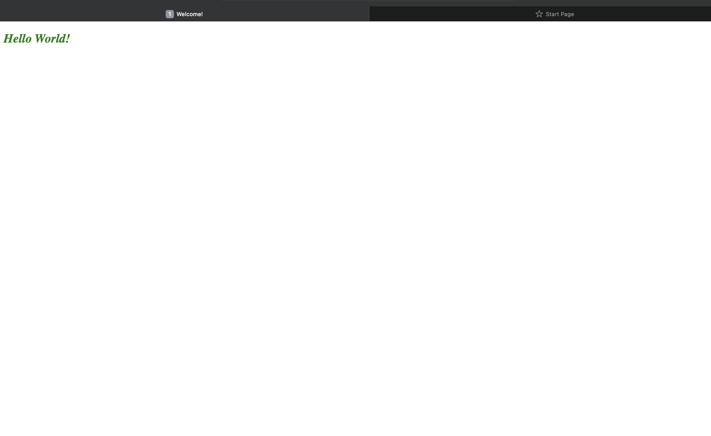

# Head

## `<head>`
- `<head>` element appear in the HTML file after `<html>` tag and before `<body>` element.
- This contains information about the page. One of the most used element inside `<head>` is `<title>` element that usually used for naming the webpage.
- `<head>` can contain information about  url link, metadata, styling and scripting.

## Some elements that are used in Head element
|Start tag|End tag|Description|
|---------|-------|-----------|
|`<title>`|`</title>`| The title element contains the website name or it's tittle on the top of the webpage. It helps the user to identify the  |
|`<link>`|`</link>`| The link tag is often used to link an external CSS file.  
|`<meta>`|`</meta>`| The meta element contains metadata (data about data) such as character set, page description, keywords. This information will not be displayed on a webpage.
|`<style>`|`</style>`| The style element is used to write internal CSS inside the HTML file. It does the styling part of a webpage such as determining the background color, font size, font style and coloring also the appearance.|
|`<script>`|`</script>`| The script element contains the JavaScript code. It helps the webpage to be more interactive 

An example of usuage CSS Styling in the head element

```html
<!doctype html>
<html>

  <head>
    
     <title>Welcome!</title>

     <style>
     h2{
         color: green;
         font-style: italic;
     }
     </style>

   </head>

<body>
    <h2> Hello World!</h2>
</body>

</html>

```
### Output


