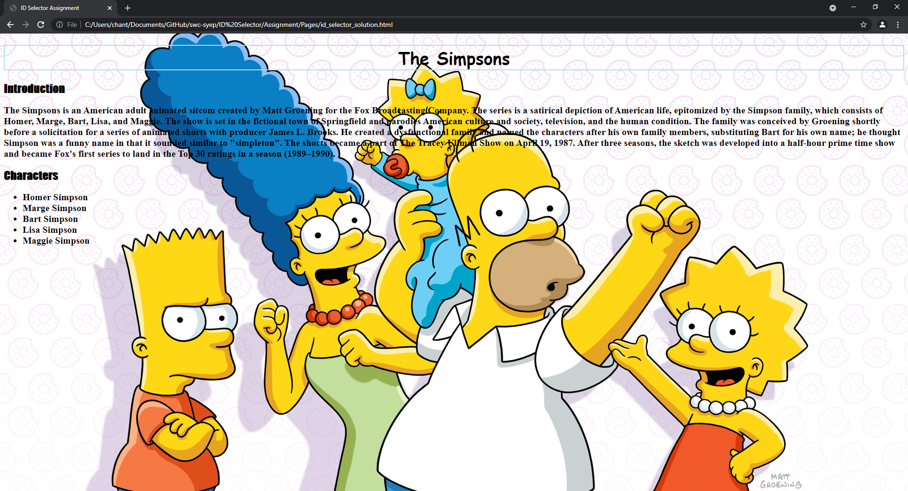

# ID Selector Assignment

Create a complete HTML web page about a movie or tv show and use ID selector to make it more attractive. Use external CSS to do the styling.

1. Go to en.wikipedia.org and search your favorite movie or tv show.

2. Copy some of the introduction of the movie or the show and create a list for the main characters.

3. Give the content some different style using ID selector

4. ## **There is no limit, try out all the styles you want and be as creative as possible!**

*Note: You can choose to do it with either internal or external CSS*

## Example
