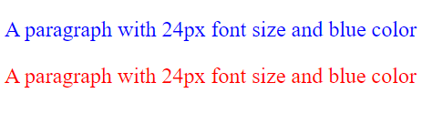

# ID Selector
Sometimes when we are styling our HTML web page. We might want to have two different looks for the same element, like two different colors `<h2>`. Well, the easiest way we can do that is through inline CSS. However, if the style we want is a complicate one, the CSS code is going to be long. And, if we do it with inline CSS, the code may look a bit messy. In that case, we could use **ID Selector** in CSS.
<br><br>

## Basic
- First, let learn the basic of ID selector
- The syntax of an ID selector
```css
#idName {
    style properties;
}
```
- We write a hastag(#) before the ID name
- Rules for ID name
    - Must have a least one character
    - Cannot start with number
    - Must be unique
- The code of an ID selector is put inside `<style>` tag
- ID selector could be internal or external
<br><br>

## How to use
- First, we need to define a style with an unique ID name
```css
#myStyle1 {
    font-size: 24px;
    color: blue;
}
```
- Then, in the start tag, we can select the style that is made for that element.
- That means one ID can only be selected by one element.
```html
<p id="myStyle1"> A paragraph with Style</p>
```
- **This is wrong**
```css
#1stStyle {  /*ID name cannot start with numbers.*/
    font-size: 24px;
    color: blue;
}
```
- **This is also wrong**
```html
<p id="style1"> paragraph 1</p>
<p id="style1"> paragraph 2</p> <!--Since paragraph 1 already selected style1 paragraph 2 cannot select it again.-->
```
<br>

## An example with internal ID selector
```html
<!DOCTYPE html>
<html>
    <head>
        <style>
            #myStyle1 {
                font-size: 24px;
                color: blue;
            }
            #myStyle2 {
                font-size: 24px;
                color: red;
            }
        </style>
    </head>

    <body>
        <p id="myStyle1">A paragraph with 24px font size and blue color</p>
        <p id="myStyle2">A paragraph with 24px font size and blue color</p>
    </body>
</html>
```
<br>

## An example with external ID selector
- Inside the .css file
```css
#myStyle1 {
    font-size: 24px;
    color: blue;
}
#myStyle2 {
    font-size: 24px;
    color: red;
}
```
- Inside the .html file
```html
<!DOCTYPE html>
<html>
    <head>
        <link rel="stylesheet" type="text/css" href="id_selector_example.css">
    </head>

    <body>
        <p id="myStyle1">A paragraph with 24px font size and blue color</p>
        <p id="myStyle2">A paragraph with 24px font size and red color</p>
    </body>
</html>
```
*Notes: Don't forget to link your .css file with your .html using `<link>` when you are doing external CSS*
<br><br>

## Output for both examples
