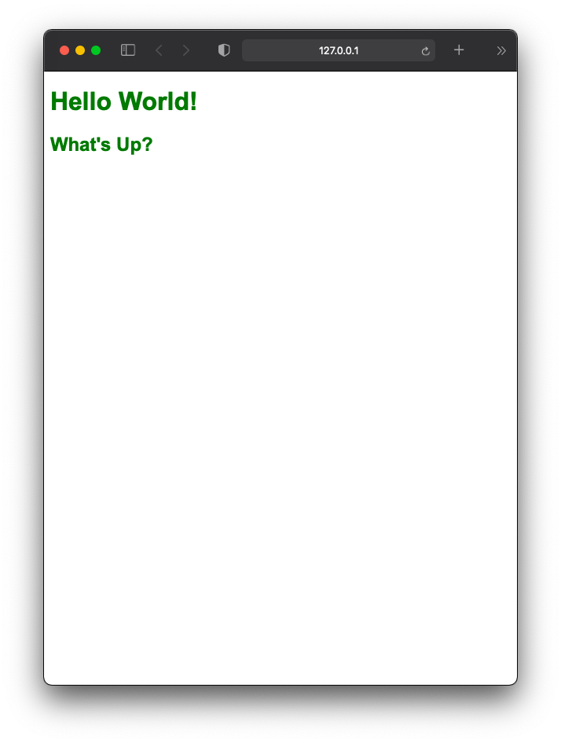

# Internal CSS
- Internal CSS is one of the popular CSS implementation method.
- CSS codes are written inside `<style>`element that usually placed inside the `<head>` element.
- `<style>` element should have a `type` attribute to indicate that styles are specified in CSS.
- The value of `type` attribute should be `text/css`
- Internal CSS is more organized and easy to observation than inline CSS.
- We can not reference internal stylesheet in other HTML files. 
- For the website with more than one page, external CSS are recommended for a better code handling.
- We must mention the elements name before `{` (curly bracket) that properties we want to change. 
- We can declare multiple elements together 

## syntax

``` html
<style type-"text/css">
h1 { color : Green; font-family: arial}
</style>
``` 
This stylesheet only changes properties inside `h1` element. But if we want to change other elements with same properties we can declare it together and separated them by a comma.

``` html
<style type-"text/css">
h1, h2 { color : Green; font-family: arial}
</style>
```
## Sample

``` html
<!doctype html>
<html>
  <head>
     <title>Hello</title>
     <style type-"text/css">
        h1, h2 { color : Green; font-family: arial}
        </style>
   </head>
<body>

    <h1> Hello World!</h1>
    <h2>What's Up?</h2>   
</body>
</html>
```
## Output


