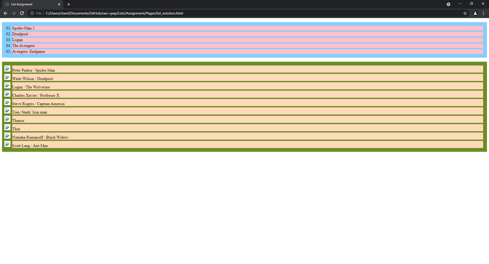

# List Assignment

Create an ordered list to rank your top 5 favorite movies and an unordered list to list 10 characters from those movies by using external CSS.

1. Requirement for the ordered list
    - Apply color (any color you like)
    - Apply a different style for the markers (the marker should be showing the ranking, so do not use bullet point or anything similar to that)
    - Set position to outside

2. Requirement for the unordered list
    - Apply color (any color you like)
    - Apply an image for the marker
        - Go to https://www.iconexperience.com/v_collection/icons/
        - Choose a suitable icon. For example, the bullet ball, bullet triagnle or bullet square
        - Download either the 16x16 or 24x24 version
    - Set position to outside

3. Apply the following for formating
    - For ordered and unordered list
        - `padding: 10px;`
    - For item of the lists
        - `margin: 5px;`
        - `margin-left: 30px;`
    - feel free to change the number and see the difference, padding and margin will be introduced in seperate notes

## Example
