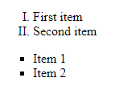
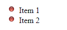
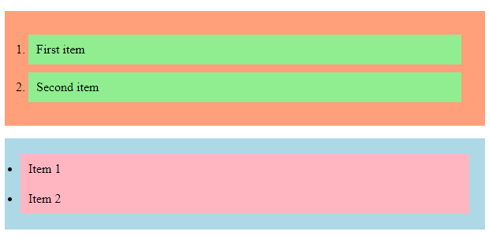
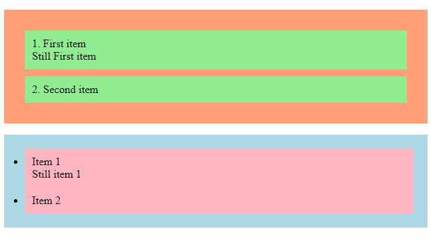
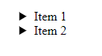

# Lists

In Text Based Tags notes, we briefly introduce lists in HTML to all of you. This time, we are getting into deeper. We are going to show you how lists can be styled using CSS.
<br><br>

## The Basic
- First, let refresh our memories
- There are two different kinds of lists
    - Ordered list
    - Unordered list
    - Description list

### Ordered List
- Each item on the ordered list is marked by number in default
```html
<ol>
    <li>Item 1</li>
    <li>Item 2</li>
</ol>
```

### Unordered List
- Each item on the unordered list is marked by bullet point in default
```html
<ul>
    <li>First item</li>
    <li>Second item</li>
</ul>
```

### Description List
- It is a list with description under the items
```html
<dl>
    <dt>HTML</dt>
    <dd>Hypertext Markup Language</dd>
    <dt>CSS</dt>
    <dd>Cascading Style Sheets</dd>
</dl>
```

### Tags Explaination
|Tag name|Description|
|--------|-----------|
|`<ol>`|To set up an ordered list|
|`<ul>`|To set up an unordered list|
|`<dl>`|To set up a description list|
|`<li>`|To list an item for ordered and unordered lists|
|`<dt>`|To list an item for description list|
|`<dd>`|To give the description for an item on description list|
<br>

## Changing Markers
- For ordered and unordered list, we can change the style of the marker. We can even use image as the marker.
- To change the marker style, we will have to use the **list-style-type** property



```css
ol {
    list-style-type: upper-roman;
}
ul {
    list-style-type: square;
}
```
- We could also use the *none* value for list-style-type to remove any markers
- To change the marker to image, we will have to use the **list-style-image** property



```css
ul {
    list-style-image: url("redBall.png");
}
```
<br>

## Changing Color
- The background color of the list can also be change
- Changing the color may help the list look more clear and interesting



```css
ol {
    background:lightsalmon;
    padding: 20px;
}
ul{
    background: lightblue;
    padding: 20px;
}
ol li {
    background: lightgreen;
    padding: 10px;
    margin: 10px;
}
ul li {
    background: lightpink;
    padding: 10px;
}
```
<br>

## Position
- The list-style-position property changes the position of the marker

|Value|Description|
|-----|-----------|
|Inside|If the value is inside, the marker will be placed inside the item and be part of the list item|
|Outside|If the value is outside, the marker will be placed outside the item. If the item has second line, it will be aligned vertically with the first line|



```css
ol {
    background:lightsalmon;
    padding: 20px;
    list-style-position: inside;
}
ul{
    background: lightblue;
    padding: 20px;
    list-style-position: outside;
}
ol li {
    background: lightgreen;
    padding: 10px;
    margin: 10px;
}
ul li {
    background: lightpink;
    padding: 10px;
    margin-left: 10px;
}
```
*Notes: As you can see, after specifiying the position property as inside for the ordered list, the numbers are moved inside the green box with the item and the second line of the item vertically aligned with the number. For the unordered list, since we apply the outside value for the position property, the bullet points are outside the pink box and the second line of the item not vertically aligned with the text bullet point but the text.*
<br><br>

## Shorthand
- Shorthand property is also avaliable for list
- We do not have to type all properties out one by one
- **list-style** property can cover all of them
- The order of the property values should be as follow
    1. type
    2. position
    3. image



```css
ul {
    list-style: disclosure-closed outside url("notExist.png");
}
```
- If the image fails, the style you specify in the first value will take effect
- Default value will be used if the property value is missing