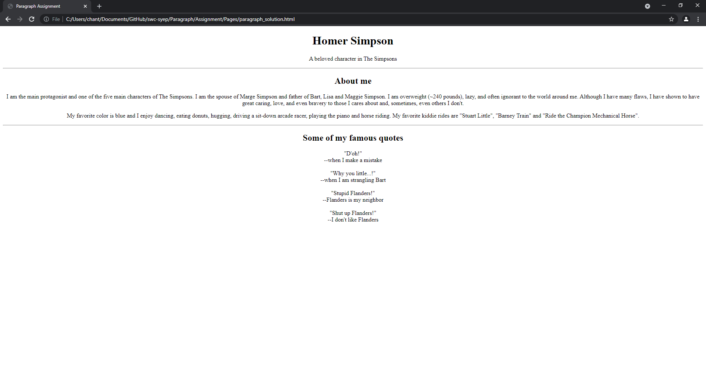

# Paragraph Assignment
Create a complete HTML web page about a fictional character by using `
` tag and all the tags we have introduced in the notes

1. Go to fandom.com and search your favorite fictional character.

2. Copy some of the biography from the website and build a web page with your own style using the tags you have learnt from paragraph notes.

*Notes: You can also use any other tags that you have learnt so far.*

## Example
