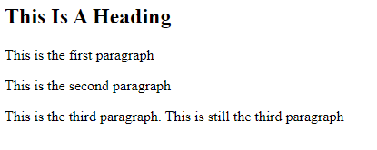
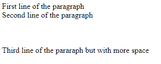
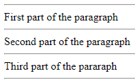
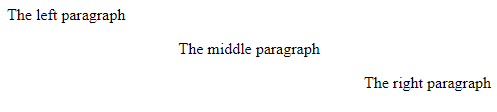

# Paragraph
`<p>` is one of the most common elements in HTML since a web page always has words in its body. However, a paragraph can be more than just words, otherwise it would be very boring to watch. Therefore, we are going to introduce some formatting and styling we can do with the paragraph element.
<br><br>

## How to use `<p>` tag
- First, let's refresh our memory of the paragraph element



```html
<h2>This Is A Heading</h2>
<p>This is the first paragraph</p>
<p>This is the second paragraph</p>
<p>
    This is the third paragraph.

    This is still the third paragraph
</p>
```

- As you can see, even thought we have multiple lines or spaces between sentences within a `<p>` tag, HTML still reduce them in single line.
- Also, `<p>` tag always add spaces before and after each paragraph
<br><br>

## Line Break
- When we need to separate multiple sentences into separate lines in `<p>`, we can use `<br>` tag.
- Unlike other tags in HTML `<br>` tag **does not have** an end tag



```html
<p>
    First line of the paragraph<br>
    Second line of the paragraph<br><br><br><br>
    Third line of the pararaph but with more space
</p>
```
<br>

## Horizontal line
- We can draw a horizontal line in our paragraph by simply adding the `<hr>` tag
- Just like the `<br>` tag, `<hr>` tag also **does not have** an end tag



```html
<p>
    <hr>First part of the paragraph
    <hr>Second part of the paragraph
    <hr>Third part of the pararaph<hr>
</p>
```
<br>

## Align
- In HTML, we can also specify the position of the paragraph, such as left right and center
- We will add the specific position that we want in the start tag, `<p align="position">`. We replace "position" with the word left, right or center.



```html
<p align="left">The left paragraph</p>
<p align="center">The middle paragraph</p>
<p align="right">The right paragraph</p>
```