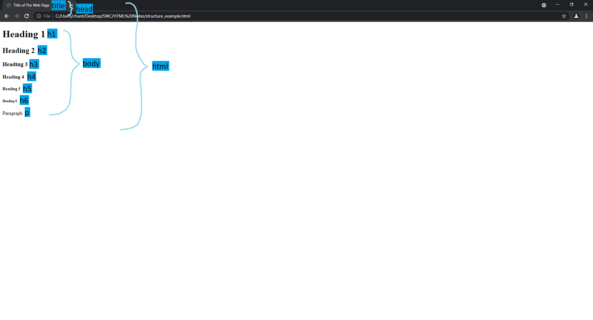

# Structure

## Intoduction to HTML (Hyper Text Markup Language)
- HTML defines the structure of a Web page.
- An HTML file consists of different elements which give instruction to browser for how to display its content

## Tags
- In an HTML file, we will see elements surrounded by <> and </> which we call them tags. Most of the tags go in pairs but not all.
- The one **without** the"/" is the start tag which goes before the element
- The one **with** the "/" is the end tag which goes after the element
- There are many different kind of elements in HTML, where they are identified by their tag names. The tag name must be specified inside <> and </>. A pair of tags cannot have different tag name.
- `<!DOCTYPE>` is not considered as an HTML tag but it must be used at the beginning in every HTML file to declare the document type. `<!DOCTYPE>` is also very special because it does not have an end tag.

### Some Basic Elements
|Start tag|End tag|Description|
|---------|-------|-----------|
|`<html>`|`</html>`|Root element of an HTML file. Contains all other elements except for the `<!DOCTYPE>` tag|
|`<head>`|`</head>`|Contains metadata which is data about the HTML file. These data can be the title, character set, styles, scripts, etc.<br/>*Notes: We will disscuss it further more in up coming notes.*|
|`<title>`|`</title>`|The title of the HTML file. It is shown on the tab bar when we open the HTML file on a brower.<br/>*Notes: Content within `<title>` tag must be text-only and it is required for every HTML file. The tag*
|`<body>`|`</body>`|Contains all the contents. For example, headings, paragraphs, tables, lists, images, etc.<br/>*Notes: We will disscuss it further more in up coming notes.*|
|`<h1>`|`</h1>`|h stands for heading. There are total 6 headings that you can define. `<h1>` is the most important and largest headning. `<h6>` is the least importand and smallest heading.<br/>*Notes: `<h1>` should not be used more than 1 time and we should not skip heading levels*|
|`<p>`|`</p>`|p stands for paragraph|

### An example of usage of all the elements above
```html
<!DOCTYPE html>
<html>
    <head>
        <title>Title of The Web Page</title>
    </head>

    <body>
        <h1>Heading 1</h1>
        <h2>Heading 2</h2>
        <h3>Heading 3</h3>
        <h4>Heading 4</h4>
        <h5>Heading 5</h5>
        <h6>Heading 6</h6>
        <p>Paragraph</p>
    </body>
</html>
```
### Output
