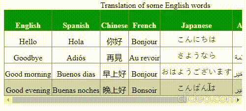

# Table Assignment

Create an ordered or unordered table with all the styling techniques you have learnt from the notes

- Requirements for the table
    - At least 5 rows including header and at least 7 columns
    - Customized borders
    - Height must be greater for head row
    - Apply color (You can either use striped or single color for header row)
    - Make the table hoverable and responsive (use `white-space: nowrap;` to prevent your cell have more than one line if there are more than one word in the cell)
    - Give the table a caption either on the top or the bottom
    - You can do some alignment if you want to

## Example
