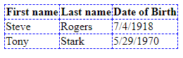

# Table

In Text Based Tags notes, we briefly introduce table in HTML to all of you. This time, we are getting into deeper. We are going to show you how table can be styled using CSS.
<br><br>

## The Basic
- First, let refresh our memories
- How to define a table in HTML

|Tag name|Description|
|--------|-----------|
|`<table>`|To setup a table|
|`<tr>`|Table row|
|`<th>`|Table header which is bold and centered by default|
|`<td>`|Table cell. Text inside is regular and left-aligned by default|

```html
<table>
    <!--The first row which is the table header-->
    <tr>
        <th>First name</th>
        <th>Last name</th>
        <th>Date of Birth</th>
    </tr>
    <!--The second row which is the first entry-->
    <tr>
        <td>Steve</td>
        <td>Rogers</td>
        <td>7/4/1918</td>
    </tr>
    <!--The third row which is the second entry-->
    <tr>
        <td>Tony</td>
        <td>Stark</td>
        <td>5/29/1970</td>
    </tr>
</table>
```
*Notes: Without any styling with CSS, table does not have borders by default in HTML*
<br><br>

## Borders
- To apply borders to tables, we use the **border** property


```css
table, th, td {
    border: 1px dashed blue;
}
```
- Border width , style and color can be customized
- Note that *Border* property is a shorthand property where the style value is required
- We can specify which border we want to customize by adding **-left/-right/-top/-bottom** after **Border**
```css
table, th, td {
    border-left: 1px dashed red;
    border-right: 1px dashed blue;
    border-top: 1px dashed orange;
    border-bottom: 1px dashed green;
}
```
- If we don't want double lines for borders, we can use **border-collapse** property and set the value to *collapse*



```css
table, th, td {
    border: 1px dashed blue;
    border-collapse: collapse;
}
```
- If we don't specifiy th and td when styling table, the borders will only circle around the table


```css
table {
    border: 1px dashed blue;
    border-collapse: collapse;
}
```
*Notes: Borders are not only avaliable for tables. They can be applied to other elemnets in HTML as well, such as paragraph or heading* 
<br><br>

## Size
- We could also adjust the width and height of the table
- If we want the width to be as long as the window, we set width to 100%


```css
table {
    width: 100%;
}
table, th, td{
    border: 1px solid black;
}
th {
    height: 40px;
}
```
<br>

## Alignment
- We could also make the table look more clear by aligning the text


```css
table, th, td{
    border: 1px solid black;
}
th {
    height: 70px;
    text-align: center;
}
td {
    height: 35px;
    text-align: center;
    vertical-align: bottom;
}
```
<br>

## Styling
- Here are some our styling that we can do we CSS to make our table more easy to read

### Color
- We could use a color to highlight the header row of the table


```css
th {
    background: blue;
    color: white;
}
```

### Striped
- We can also have a zebra-striped table which has a different color for odd or even row


```css
tr:nth-child(even) {
    background: lightgoldenrodyellow;
}
```

### Hoverable
- We can have the table row highlighted when our mouse pointer is on top a that row by using the **:hover** selector


```css
tr:hover {
    background: lightgrey
}
```

### Responsive
- If the table is too big for the window, we can have a scroll bar to scroll throught the table instead of squeezing the table to make it fit into the window
- We can do that by using the div element to wrap the table element
```css
<div style="overflow-x:auto;">
    <table>
    ...
    </table>
</div>
```
- Make the window smaller to see the scroll bar under the table
<div style="overflow-x:auto;"></div>
    <table>
        <tr>
            <th>Header 1</th>
            <th>Header 2</th>
            <th>Header 3</th>
            <th>Header 4</th>
            <th>Header 5</th>
            <th>Header 6</th>
            <th>Header 7</th>
            <th>Header 8</th>
            <th>Header 9</th>
            <th>Header 10</th>
        </tr>
        <tr>
            <td>Cell 1.1</td>
            <td>Cell 1.2</td>
            <td>Cell 1.3</td>
            <td>Cell 1.4</td>
            <td>Cell 1.5</td>
            <td>Cell 1.6</td>
            <td>Cell 1.7</td>
            <td>Cell 1.8</td>
            <td>Cell 1.9</td>
            <td>Cell 1.10</td>
        </tr>
        <tr>
            <td>Cell 2.1</td>
            <td>Cell 2.2</td>
            <td>Cell 2.3</td>
            <td>Cell 2.4</td>
            <td>Cell 2.5</td>
            <td>Cell 2.6</td>
            <td>Cell 2.7</td>
            <td>Cell 2.8</td>
            <td>Cell 2.9</td>
            <td>Cell 2.10</td>
        </tr>
    </table>
</div>

### Caption
- We could also add caption to the table
- We just need to put `<caption>` element inside `<table>` element
- We can set the caption to be either on the top or the bottom of the table by using the **caption-side** property
- Captions are on the top by default


```html
<table>
    <caption style="caption-side: top/bottom">Some caption</caption>
    ...
</table>
```