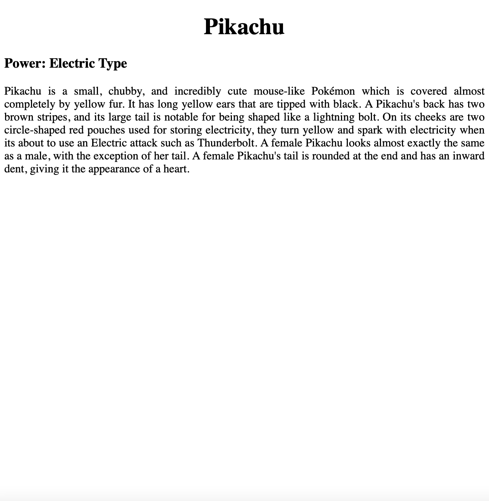

# Text-align assignment
Create a webpage about your favoritte Pokemon character:
- Use `<h1>` tag for Pokemon Character name and align it to the center.
- Mention the type of power on the left 
- write about the pokemon using paragraph tag and choose text-alignment valus as "justify". (You can retrieve the information from websites)

Sample:

