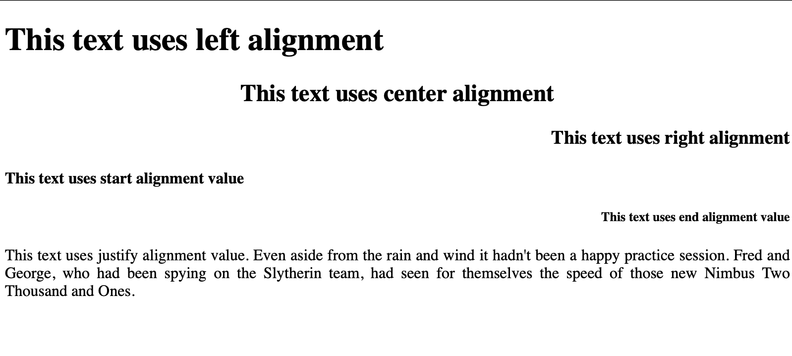

# Text Align
The `text-align` is a property that helps to set up the horizontal alignment of a text. Text alignment can be set up on the left, right or center. 

## Syntax
`text-align: left | right | center | start | end | justify `

## Values

| Values |Description|
|-----------|-----------|
| `left` | Align the text to the left |
| `right` | Align the text to the right |
| `center` | Align the text to the center |
| `start` | Align the text to the start edge of the containing box (similar to left) |
| `end` | Align the text to the end edge of the containing box (similar to right) |
| `justify` | This indicates that every line in a paragraph, except the last line should take the full width of the containing box |

Sample
``` html
h1{
    text-align: left;
}
h2{
    text-align: center;
}
h3{
    text-align: right;
}
h4{
    text-align: start;
}
h5{
    text-align: end;
}
p{
    text-align: justify;
}
```
Output



Notes: Justify text looks at the words on each individual line and creates an equal gap between words.
