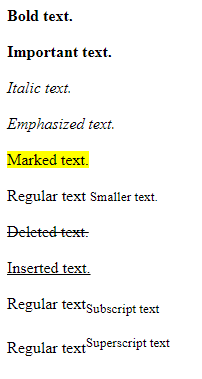

# Text Formatting

There are several tags we can use to display text in special way with HTML. Today, we are going to go through some of the most common and useful text formatting tags.

- Bold text: `<b>`
- Important text: `<strong>`
- Italic text: `<i>`
- Emphasized text: `<em>`
- Marked text: `<mark>`
- Smaller text: `<small>`
- Deleted text: `<del>`
- Inserted text: `<ins>`
- Subscript text: `<sub>`
- Superscript text: `<sup>`



```html
<b>Bold text.</b>
<br><br>

<strong>Important text.</strong>
<br><br>

<i>Italic text.</i>
<br><br>

<em>Emphasized text.</em>
<br><br>

<mark>Marked text.</mark>
<br><br>

Regular text <small>Smaller text.</small>
<br><br>

<del>Deleted text.</del>
<br><br>

<ins>Inserted text.</ins>
<br><br>

Regular text<sub>Subscript text</sub>
<br><br>

Regular text<sup>Superscript text</sup>
```
*Notes: Notice that `<bold>` and `<strong>` have the same output but they have different semantic meaning. While `<strong>` tag states the importance of the text, `<bold>` tag just make the text stylish and look different than regular text. The situation for `<i>` and `<em>` is the same. `<i>` tag is just text styled in italic but `<em>` tag represents stress emphasis.*