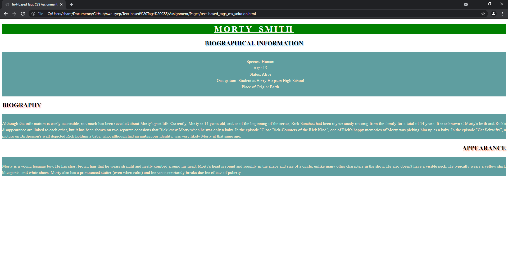

# Text-based Tags CSS Asignment

Introduce one of your favorite fictional character with text that is styled with CSS. You can search up the information on Fandom

- Requirements
    - Character's name
        - `<h1>`
        - colored text and background
        - specifiy alignment
        - use decoration
        - customize letter space
        - customize word space
        - transform to uppercase
    - Biographical information (Title)
        - `<h2>`
        - specifiy alignment
        - customize shadow
        - transform to uppercase
    - Biographical information (Body)
        - `
`
        - specifiy alignment
        - set **white-space** to *pre*
        - colored text and background
        - customize line height
    - Biography (Title)
        - `<h2>`
        - specifiy alignment
        - customize shadow
        - transform to uppercase
    - Biography (Body)
        - `
`
        - specifiy alignment
        - set **white-space** to *pre-line*
        - colored text and background
        - customize line height
    - Appearance (Title)
        - `<h2>`
        - specifiy alignment
        - customize shadow
        - transform to uppercase
    - Appearance (Body)
        - `
`
        - specifiy alignment
        - set **white-space** to *pre-line*
        - colored text and background
        - customize line height

## Example
