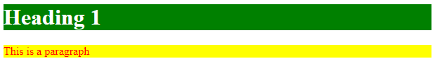
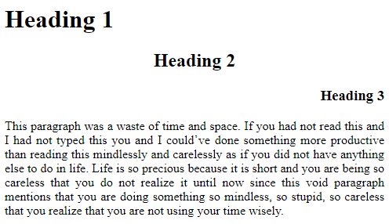
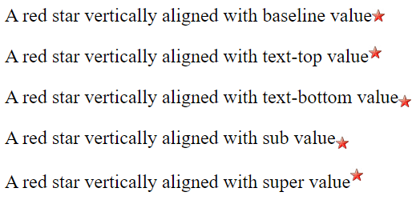
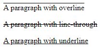
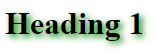

# Text-based Tags CSS

Today, we are going to look at some styling we can do with text-based elements, such as heading and paragraph.
<br><br>

## Color
- Color of the text and the background can be changed
```css
h1 {
    color: white;
    background-color: green;
}
p {
    color: red;
    background-color: yellow;
}
```

<br><br>

## Alignment
- We could set horizonatal alignment of the text



```css
h1 {
    text-align: left;
}
h2 {
    text-align: center;
}
h3 {
    text-align: right;
}
p {
    text-align: justify;
}
```
- We could also set vertical alignment



```css
img.baseline {
  vertical-align: baseline;
}
img.top {
  vertical-align: text-top;
}
img.bottom {
  vertical-align: text-bottom;
}
img.sub {
  vertical-align: sub;
}
img.super {
  vertical-align: super;
}
```
<br>

## Decoration
- There are 3 text decoration we could learn about
    - overline
    - line-through
    - underline



```css
p.overline {
    text-decoration: overline;
}
p.lineThrough {
    text-decoration: line-through;
}
p.underline {
    text-decoration: underline;
}
```
<br>

## Transformation
- There are 3 type of transformation
    - uppercase: change every charater to uppercase
    - lowercase: change every charater to lowercase
    - capitalize: change the first character of every word to uppercase
```css
p {
    text-transform: uppercase/lowercase/capitalize;
}
```
<br>

## Indentation
- We could specify the indentation of a text
```css
p {
    text-indent: 20px
}
```
<br>

## Letter Spacing
- We could specify the space between characters
- use **positive** number to increase the space or **neigative** number to reduce the space
```css
p.moreSpace {
    letter-spacing: 5px;
}
p.lessSpace {
    letter-spacing: -5px;
}
```
<br>

## Word Spacing
- We could specify the space between words
- use **positive** number to increase the space or **neigative** number to reduce the space
```css
p.moreSpace {
    word-spacing: 5px;
}
p.lessSpace {
    word-spacing: -5px;
}
```
<br>

## Line Height
- We could specify the height of each line in a text
- We don't need unit for **line-height**
- The default value for **line-height** is 1, setting it less than one will reduce the spacing between lines and setting it greater than one will increase the spacing between lines
```css
p {
    line-height: 2;
}
```
<br>

## Shadow
- We could add shadow effect to our text
- The values for **text-shadow**
    1. Horizontal shadow (Required)
    2. Vertical shadow (Required)
    3. Blur effect (Optional)
    4. Color (Optional)



```css
h1 {
    text-shadow: 3px 3px 6px green;
}
```
<br>

## White Space
```css
p {
    white-space: nowrap/pre/pre-line/pre-wrap;
}
```
|Value|Description|
|-----|-----------|
|nowrap|Line will never break. Text will only be displayed on one single line unless the `<br>` tag is used|
|pre|Text will be displayed in the way that is the same as the source code|
|pre-wrap|Same as *pre* except that line will break by itself if window is too small|
|pre-line|Same as *pre-line* except that spaces or indentations that are made manually in source code will not be shown.

|Value|Line break|Spaces and indentations|Text wrapping|
|-----|--------|-----------------------|-------------|
|nowrap|Never|Not saved|No wrap|
|pre|Same as source code|Same as source code|Same as source code|
|pre-wrap|When necessary|Saved|Wrap|
|pre-line|When necessary|Not saved|Wrap|