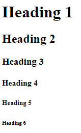
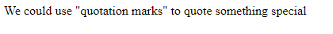

# Text-based Tags
In this lesson, we are going to introduce some useful text based tags to you.
<br><br>

## `<h>` tags
- There are total 6 heading tags, `<h1>`, `<h2>`, `<h3>`, `<h4>`, `<h5>`, `<h6>`
- `<h1>` tag has the largest font size which also means it is the most important heading
- `<h6>` tag has the smallest font size and it is the least important among all 6
- Each web page typically has **AT LEAST ONE** and **ONLY ONE** `<h1>` tag
- Keep in mind that we should not skip the heading level



```html
<h1>Heading 1</h1>
<h2>Heading 2</h2>
<h3>Heading 3</h3>
<h4>Heading 4</h4>
<h5>Heading 5</h5>
<h6>Heading 6</h6>
```
***Something you might want to know:** The reason why heading is so important is because headings are used in seach engines. Which means if some search on something that matches your headings, your web page will be included in the search result.*
<br><br><br>

## `<p>` tag
- `<p>` A paragrapgh that you wanted to add to your web page
```html
<p>I am on a seafood diet, I see food and I eat it</p>
<p>
    What did the shark say when he ate the clownfish?
    This tastes a little funny.
</p>
```

<br>*Notes: Even though you type your sentences in separate line inside `<p>` tag, the output is still showing your paragraph in one line unless you use two separate `<p>` tag. But is it possible to separate the sentences without using multiple `<p>` tags? The answer is yes. We just need to add `<br>` tag between the sentences.*
<br><br><br>

## `<pre>` tag
- `<pre>` tag is similar to `<p>` tag. The difference between them is `<pre>` tag preserve all spaces and and lines break that we type in our source code
```html
<p>
        Problem: Compiler raised 468 errors after modifying the code.
        Solution: Ctrl + Z
</p>

<pre>
        Problem: Compiler raised 468 errors after modifying the code.
        Solution: Ctrl + Z
</pre>
```

<br><br><br>

## `<blockquote>` tag
- Creates spaces on both left and right side of the text
- Specifies source but it is not displayed in the brower
```html
<p>Example</p>

<blockquote cite="https://blog.hubspot.com/sales/famous-quotes">If you set your goals ridiculously high and it's a failure, you will fail above everyone else's success. -James Cameron</blockquote>

<p>Example</p>
```

<br><br><br>

## `<q>` tag
- To make a small quotation
- Normally brower will insert quotation mark around the text
- It could appear inside other tags like `<p>` tag
```html
<p>We could use <q>quotation marks</q> to quote something special</p>
```

<br><br><br>

## `<a>` tag
- When user click on the text, it will take you to a dedicated website


```html
<a href="https://www.studentswhocode.com">Visit StudentsWhoCode.com!</a>
```
<br><br>

## `<table>` tag
- There are 3 tags that we use with `<table>` tag:
    - `<tr>`: table row
    - `<th>`: table header
    - `<td>`: table cell
- We create a table row by row
- However, without styling with CSS, the table HTML generate does not have borders


```html
<style>
    table, th, td {
    border: 1px solid black;
    }
</style>

<table>
    <tr>
        <th>Header 1</th>
        <th>Header 2</th>
    </tr>
    <tr>
        <td>cell 1</td>
        <td>cell 2</td>
    </tr>
</table>
<table>
    <tr>
        <th>Header 1</th>
        <th>Header 2</th>
    </tr>
    <tr>
        <td>cell 1</td>
        <td>cell 2</td>
    </tr>
</table>
```
*Notes: We will learn more about `<style>` when we get to CSS.*
<br><br><br>

## Lists
- There are 3 kinds of list
    - unordered list
    - ordered list
    - definition list
- The different between unordered list and order list is the items in unordered list are listed with bullet point, whereas ordered list shows its items with numbers
- In definition list, we have a term and then its definition


```html
<ul>
    <li>Item 1</li>
    <li>Item 2</li>
</ul>

<ol>
    <li>1st item</li>
    <li>2nd item</li>
</ol>

<dl>
    <dt>HTML</dt>
    <dd>Hyper Text Markup Language</dd>
    <dt>CSS</dt>
    <dd>Cascading Style Sheets</dd>
</dl>
```
<br><br>