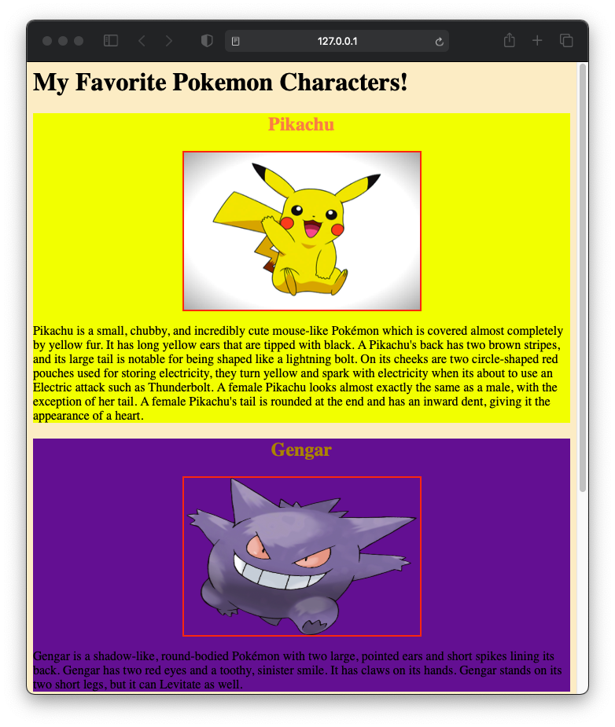

# Color Assignment
Create a webpage introducing your most 3 favorite pokemon/ anime
- for each character create a division using `
` tag
- Put Character name on the top. Color it.
- Put a picture of the character. Do 2px solid border. (pick any color for border)
- Specify background color for the every character based on its relevant theme.
- write about the character name. 
- Specify the color of first character using name color, second character using hexadecimal code, third character using RGB value.
 
 Sample output:
 

