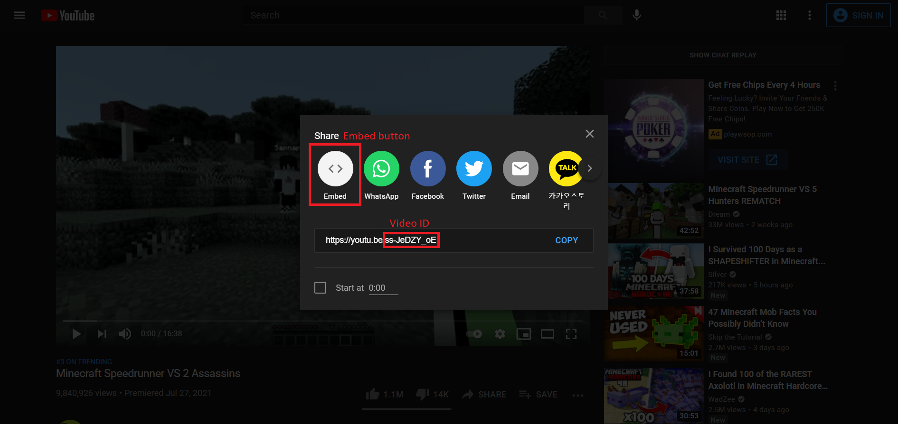

# iFrame
In this note, we are going to introduce iFrame to you, specifically iFrame with Youtube.
<br><br>

## What is iFrame?
- iframe let you display another web page inside the current web page
- We use `<iframe>` tag to setup an iFrame in HTML
```html
<iframe src="https://www.youtube.com/embed/ss-JeDZY_oE" title="A Youtube Video"></iframe>
```
- We could put a brief description for the **title** attribute


*Notes: By default, the iFrame is pretty small and has borders. However, those can be modified or removed.*
<br><br>

## Height and Width
- To set height and width for iFrame, we just need to add the value into the start tag
```html
<iframe style="width: 560; height: 315;" src="https://www.youtube.com/embed/ss-JeDZY_oE" title="A Youtube Video"></iframe>
```
- We could set the size of an iFrame without the style attribute as well
```html
<iframe width="560" height="315" src="https://www.youtube.com/embed/ss-JeDZY_oE" title="A Youtube Video"></iframe>
```


<br><br>

## Borders
- For borders, other than removing them, we could also customize them
- To remove them, we just need to add the **border** property in style with the value *none*
```html
<iframe style="width: 560; height: 315; border: none;" src="https://www.youtube.com/embed/ss-JeDZY_oE" title="A Youtube Video"></iframe>
```


- We could also make some borders that we like
```html
<iframe style="width: 560; height: 315; border: 4px solid blue;" src="https://www.youtube.com/embed/ss-JeDZY_oE" title="A Youtube Video"></iframe>
```


<br><br>

## How to display a Youtube video in iFrame?
- To diplay a Youtube video, we cannot just copy the video's url and paste it in the `<iFrame>` start tag.
- What we actually have to do is to get the embedded link and use that link for the **src** attribute instead of the original link.
- To get the embedded link of a youtube video, first we need to click the share button


- After clicking the share button, a box will pop up with an url
- What we want to get is the video ID at the end of the url
- After we have the video ID, we can create the embedded link
    - https://www.youtube.com/embed/videoId



- The other way to get the embedded link is by clicking the Embed button
- After that the entire code for the iFrame element will show up
- We can copy the whole code to our .html file


*Notes: Some videos on Youtube are forbidden to be embedded in a localhost environment. Therefore, you might see the message: Video unavailable when you are trying your code. The only way to fix it is to put your web page out in public.*

## Some customization we can do with embedded Youtube video
- To do the customization, first we need to put a question mark(?) right behind the video ID.
- If if have more than one customization, we separate them with the ampersand(&)

### Autoplay
- To have the video played by itself, we just need to add **autoplay=1** after the url
```html
<iframe src="https://www.youtube.com/embed/videoId?autoplay=1"></iframe>
```
- However, most of the browsers do not allow autoplay video on them

### Mute
- If the brower does not allow autoplay, we can add **mute=1**
- muted autoplay is always allowed
```html
<iframe src="https://www.youtube.com/embed/videoId?autoplay=1&mute=1"></iframe>
```

### Playlist
- We can also setup a playlist for an iFrame
- The iFrame will automatically play the next video if there is any
- To setup a playlist, we add **playlist=videoId** to the url followed by the video ID and each ID will be separated by a comma(,)
```html
<iframe src="https://youtube.com/embed/videoId1?playlist=videoId1,videoId2..."></iframe>
```

### Loop
- After we have a listen, we can put those video on loop
- We can loop for only one video, if we only put one video ID in playlist
- To set the video on loop, we add **loop=1** (loop forever)
```html
<iframe src="https://youtube.com/embed/videoId1?playlist=videoId1,videoID2&loop=1"></iframe>
```

### Controls
- If we set controls to 0, user will only have option to play or pause
- Fast forward, backtracking, chaning volume, changing video quality, changing playback speed will be disabled
```html
<iframe src="https://www.youtube.com/embed/videoId?controls=0"></iframe>
```

### Start at
- We could also set up a start point for the video
- To set it up we just need to add **start=(the second you want to start)**
```html
<iframe src="https://www.youtube.com/embed/videoId?start=120"></iframe>
<!--The video will start at 2 minutes-->
```