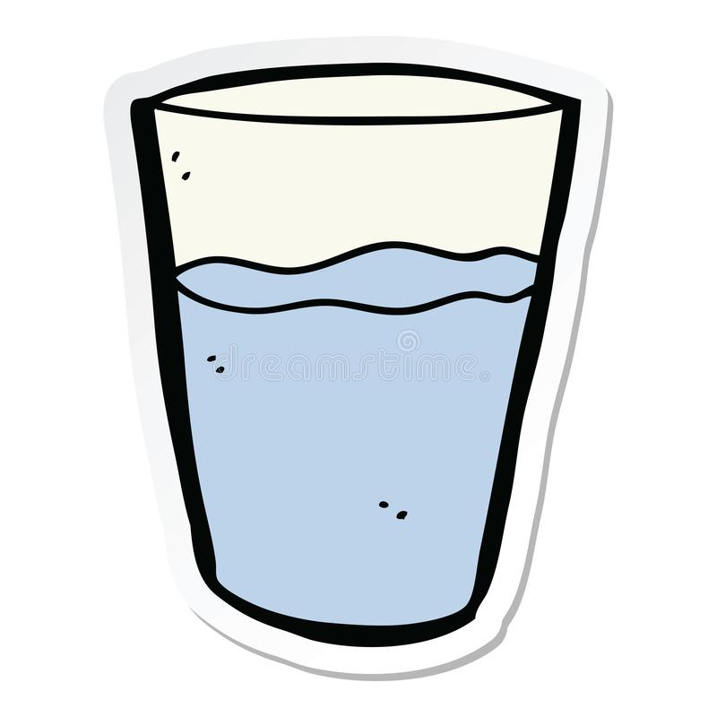
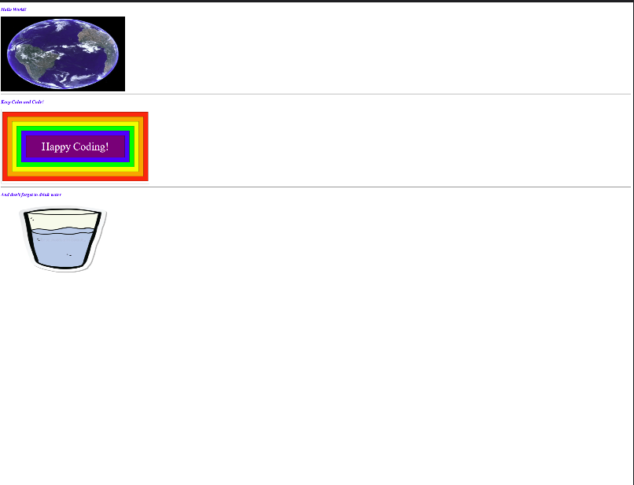

# Images
- Images play an important role in a web page to make it look more attractive. Images also helps improve the design and make its more user-friendly. 
- a logo, diagram, GIF also consider as images.
- `` tag is used to insert an image in a webpage. 

## Adding Images 
- To add an images in a web page we need to use `` element.
- `` is an empty element that means it doesn't have closing tag.
- `` element contains two attributes: `src` and `alt`.
- `src` contains the source path of the image. The direction of assigned link in src should exist same in the server folder. Therefore, its better to create an image folder inside the source folder and put all images inside that folder. For example: ` src = "images/apple.jpg" `
- `alt` contains information about the image. This textual description helps if you want to publish the website in a server and let users to find the the picture by searching. `alt` should be relevant to the image topic. For Example, if you add an image of an apple in you web page you should assign `alt` as `"Apple"` if you want it to be searchable by users.

Syntax

``` html

```
- `title` is an another attribute that provide additional information about the picture.

## Height and Width
To make our web page look cool and organized, we can modify the size and appearance of the picture in the webpage by using `height` and `width` attribute. These attributes specify the size of the pictures in pixels.
- `height` specifies the height of the image in pixels.
- `width` specifies the width of the image in pixels.

## Type of Image Format
There are several type of image format to use in a web page. The reason for using formats is to ensure the quality of the photo respecting its file size.

some image formats are:
- JPG
- SVG
- JPG
- PNG

## `GIF` 
- GIF is one of the oldest format.
- Does well compressing large areas of a single color.
- Limited color space of 256 colors.
- Can do transperancy
- Can have multiple frames, that makes it look like annimated movie.
## `SVG`
- stands for "Scalable Vector Graphic"
- Ideal format for logos and icons
- It can seak to massive size and still look neat, like they were built for it.
## `JPG`
- Usually JPG images contains lot of memory that makes the website runs very slow. Therefore, it's better to resize the size before put in the webpage.
- we can make a balance between the quality and the file size. 
- Balancing can be done manually or rely on software on web service to handle task.
## `PNG`
- Good at compression
- Images that need transparency

Sample 

``` html
<!doctype html>
<html>

  <head>
     <title>Welcome!</title>
   </head>

<body>

    <h3 style="font-style: italic; color: blue;"> Hello World!</h3>
     <hr />
    <h3 style="font-style: italic; color: blue;"> Keep Calm and Code!</h3>
     <hr/>
    <h3 style="font-style: italic; color: blue;"> And don't forget to drink water</h3> </hr>
    

</body>

</html>

```

Output



