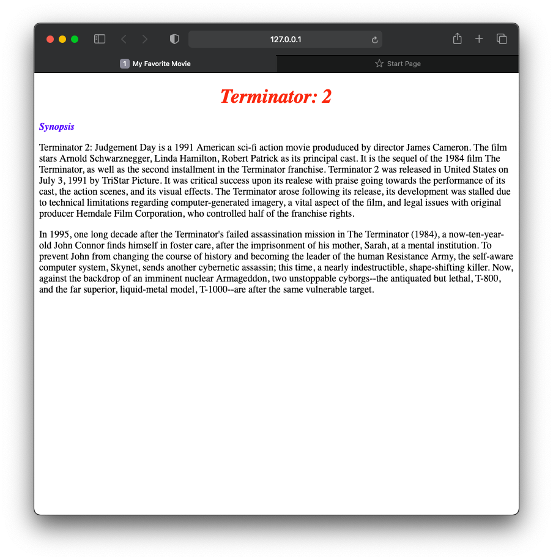

# Activity for Inline CSS
Create a web page providing a synopsis of your favourite movie.
- The movie title should be Bold, itallic and placed on the top 
- Align the movie title in the center
- Write "Synopsis" on the below of the title
- The font size of "Synopsis should be smaller than the movie title (pick a different font color)
- Paragram about the movie synopsis should be in `
` element.
- You can use Wikipedia for your favorite movie's synopsis.

Sample:

